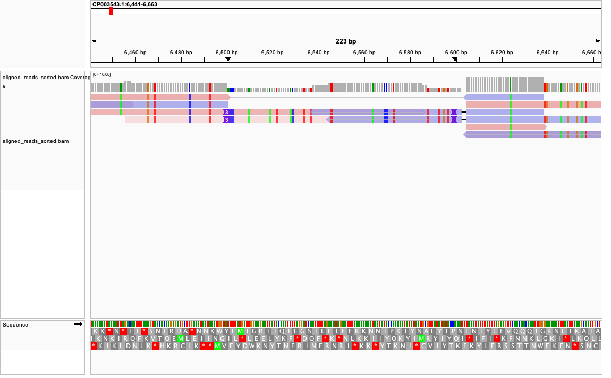
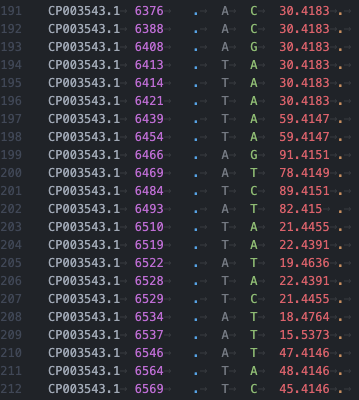
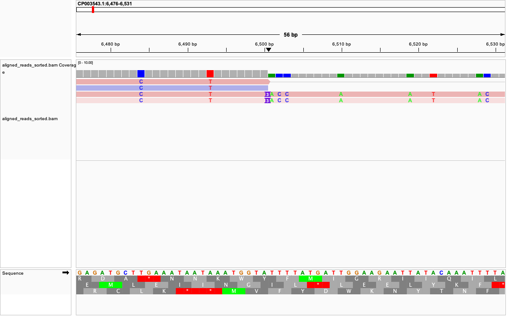
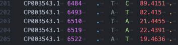
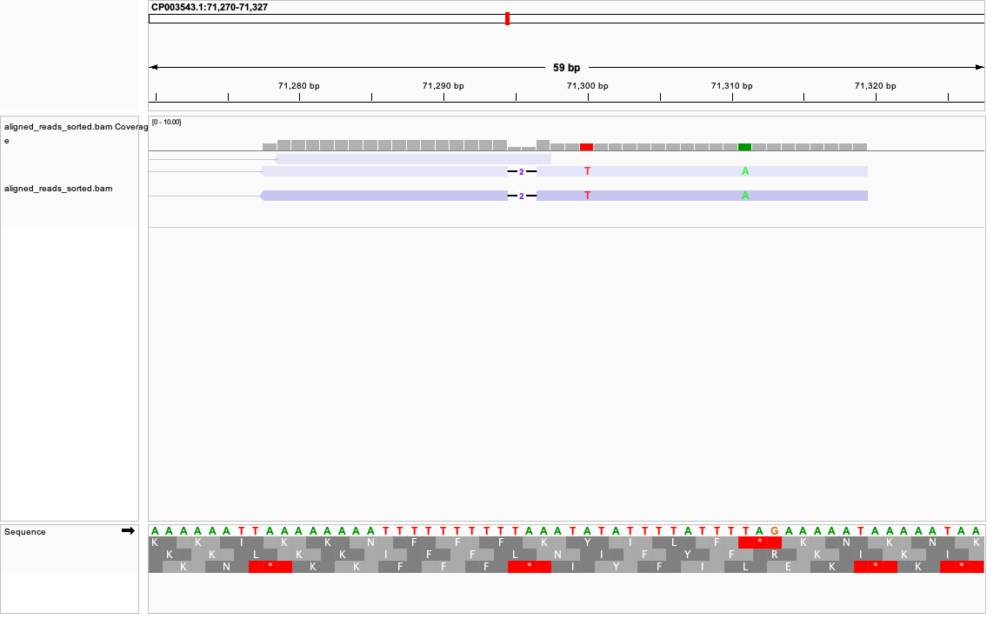
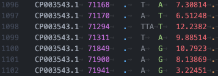

## Variant Calling
-----
Relevant code from Makefile:
```
call:
	mkdir -p vcf
	bcftools mpileup -Ou -f $(SPECIES).fna $(output_dir)/aligned_bam/aligned_reads_sorted.bam | \
	bcftools call -mv -Ou -o vcf/$(SPECIES).vcf
```
#### Variant summary:

2298 total variants
```
grep -v "#" | vcf/${SPECIES}.vcf | wc -l
```

Mean variant quality: 25.3348

```
awk -F'\t' '{ sum += $6 } END { print sum / NR }' vcf/${SPECIES}.vcf 
```

0 sites with multiple alleles called (!)
```
bcftools filter --include "AC>2" vcf/${SPECIES}.vcf
```

#### IGV manual inspection of variants:
Overall I thought most of the variants were called when I expected them to be. There were a few cases where it seemed like indels were not consistently called, examples below.

Most variants on this section were called in the vcf.




Here we can see where an indel is not called, despite 2 reads providing support. The indel should be located at position 6501.




In contrast, here the indel was called despite having the same number of reads supporting. The indel is located at position 71294.




Ultimately, most of these variants were accurately called, and in the cases where it seemed inconsistent, I would argue that lack of coverage probably gave the variant a low quality score, filtering it out of the final vcf. 