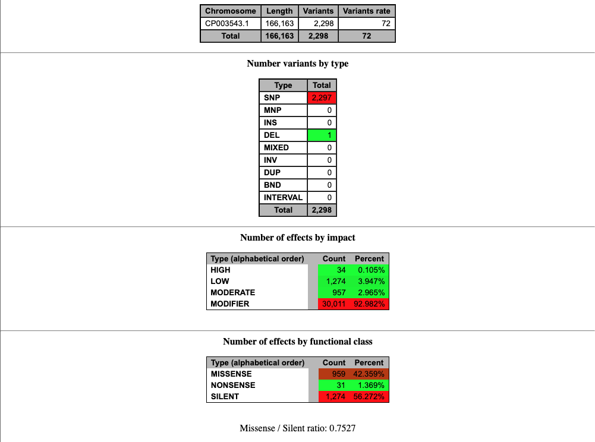

#### HW 11
----

Using the Carsonella ruddii genome, I attempted to create a custom database, which was tricky as promised, and I ran into lots of errors when trying to fix the config file. Eventually I used the code provided in the snpeff.mk file and was  able to create a custom database without much much trouble.

```
${SNPEFF_DB}: ${GFF} ${REF}	
	mkdir -p ${IDX}/${LABEL}

	# Copy the files to the snpEff folder.
	cp -f ${REF} ${IDX}/${LABEL}/sequences.fa
	cp -f ${GFF} ${IDX}/${LABEL}/genes.gff

	# Make the configuration file.
	echo "${LABEL}.genome : ${LABEL}" >	snpeff.config

	# Build the database.
	snpEff build -dataDir ${IDX} -v ${LABEL}

build: ${SNPEFF_DB}
	@ls -lh ${SNPEFF_DB}

snpeff: ${SNPEFF_DB}
	mkdir -p results
	snpEff ann -csvStats ${CSV} -s ${HTML} -dataDir ${IDX} -v ${LABEL} ${VCF} | bcftools view -O z -o ${EFF}
	bcftools index ${EFF}
```

The variants in this genome were classified as follows:



I found it interesting that there were not more indels, but that can probably be explained by the extraordinarily small genome (166 kb).