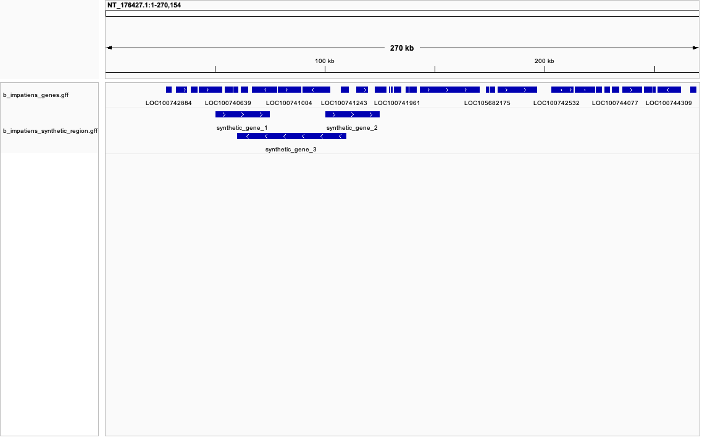

# Download genome and gff3 file
Downloaded the genome of the Common Eastern Bumble Bee, Bombus impatiens. 
```
datasets download genome accession GCF_000188095.3 --include genome,gff3
```

# unzip the file
```
unzip ncbi_dataset.zip
```
# Separate intervals of type "gene" into a different file.
```
cat ncbi_dataset/data/GCF_000188095.3/genomic.gff | awk '$3 == "gene"' > b_impatiens_genes.gff
```
# Quick count of annotated genes
```
echo "Number of annotated genes:"
cat b_impatiens_genes.gff|wc -l
```

# View the genome in IGV
This step required indexing the genome through igvtools before loading it.


# Create synthetic GFF file and add it to IGV

