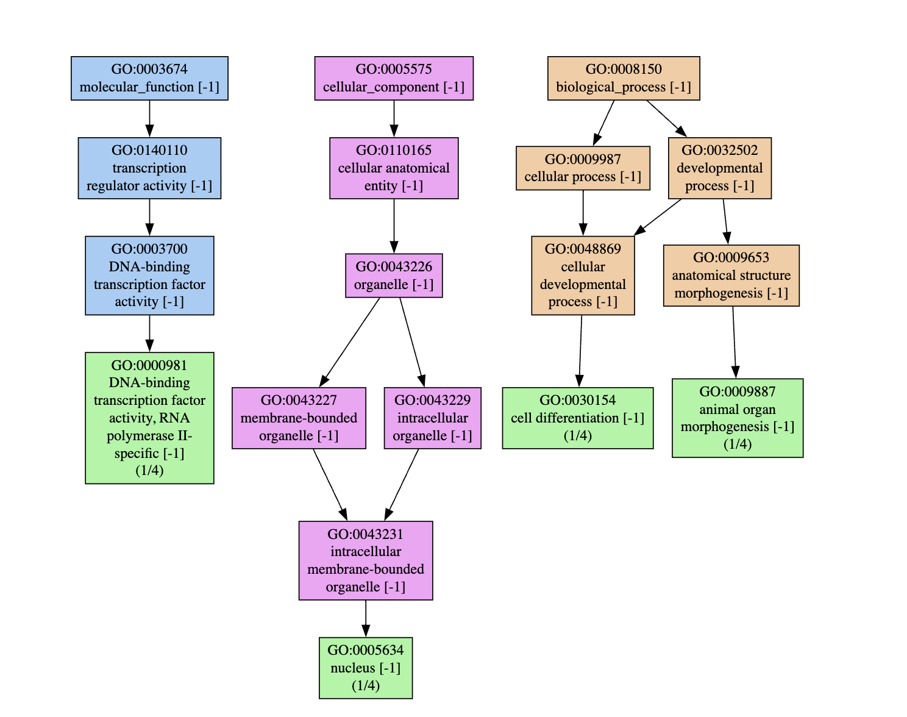

### Sequence Ontology
----
1. Choose a feature type from the GFF file and look up its definition in the sequence ontology.

The gff_analysis.sh printed out the following:

```
Number of annotated genes:
   12925
Top 10 most frequent annotation features:
248470 exon
216805 CDS
24471 mRNA
12925 gene
5460 region
2481 lnc_RNA
1600 cDNA_match
 780 transcript
 236 pseudogene
 203 tRNA
```
I chose to look up pseudogene. 

2. Find both the parent terms and children nodes of the term.

```
bio --download
bio explain pseudogene
```
Output:
```
Parents:
- biological_region 
- gene (non_functional_homolog_of)

Children:
- processed_pseudogene 
- pseudogenic_transcript (part_of)
- non_processed_pseudogene 
- polymorphic_pseudogene 
- transposable_element_pseudogene 
- vertebrate_immune_system_pseudogene
```
3. Provide a short discussion of what you found.

Genes being a parent term for pseudogene makes sense to me, because pseudogenes often come into existence from duplication events, retain all the structural elements of a gene, but then gain mutations that cause it to become inactive. As a child term, psuedogenic_transcript was really fascinating and researching that took me down a bit of a rabbit hole looking up how pseudogenes can regain function.

### Gene Ontology
----
1. Identify a CC, MF, and BP term in the gene ontology relevant to your organism with a method of your choice.
    
    Using a combination of genescape and NCBI, I identified the GO terms associated with a gene my lab is interested in.

2. Explain the term and show its parent terms and children nodes.

    There are actually multiple terms here associated with one gene, I chose three examples. 

```
GO:0000981 (MF: DNA-binding transcription factor activity, RNA polymerase II-specific)
GO:0009887 (BP: animal organ morphogenesis)
GO:0005634 (CC: cellular_component)
```


3. Find genes that are annotated with the term. List the genes.

The gene of interest here is abd-B (abdominal B). It is a Hox gene that is typically active in the posterior section of the abdomen in insects. Hox genes are transcription factors which regulate expression in different segments of the body -- very critical for limb generation and body segmentation.

Other genes in the genome that have the same GO terms can be found using the following commands:

```
# Download your gaf file from NCBI FTP
curl -Ol https://ftp.ncbi.nlm.nih.gov/genomes/all/GCF/000/188/095/GCF_000188095.3_BIMP_2.2/GCF_000188095.3_BIMP_2.2_gene_ontology.gaf.gz

# Unzip the file
gunzip GCF_000188095.3_BIMP_2.2_gene_ontology.gaf.gz

# Search for matching GO term
cat GCF_000188095.3_BIMP_2.2_gene_ontology.gaf | grep "GO:0009887"
```
Output:
```
NCBIGene	100740244	LOC100740244	involved_in	GO:0009887	PMID:30032202	IEA	PANTHER:PTN008468024	P	NA		protein	taxon:132113	20231210	RefSeq		
NCBIGene	100741037	LOC100741037	involved_in	GO:0009887	PMID:30032202	IEA	PANTHER:PTN000219824	P	NA		protein	taxon:132113	20231210	RefSeq		
NCBIGene	100741402	LOC100741402	involved_in	GO:0009887	PMID:30032202	IEA	PANTHER:PTN002670253|PANTHER:PTN002670254	P	NA		protein	taxon:132113	20231210	RefSeq		
NCBIGene	100745452	LOC100745452	involved_in	GO:0009887	PMID:30032202	IEA	PANTHER:PTN000677741	P	NA		protein	taxon:132113	20231210	RefSeq		
NCBIGene	100745674	LOC100745674	involved_in	GO:0009887	PMID:30032202	IEA	PANTHER:PTN000160073	P	NA		protein	taxon:132113	20231210	RefSeq		
NCBIGene	100746347	LOC100746347	involved_in	GO:0009887	PMID:30032202	IEA	PANTHER:PTN000932615	P	NA		protein	taxon:132113	20231210	RefSeq		
NCBIGene	100747138	LOC100747138	involved_in	GO:0009887	PMID:30032202	IEA	PANTHER:PTN000160655	P	NA		protein	taxon:132113	20231210	RefSeq		
NCBIGene	100749276	LOC100749276	involved_in	GO:0009887	PMID:30032202	IEA	PANTHER:PTN008559000	P	NA		protein	taxon:132113	20231210	RefSeq		
NCBIGene	105680917	LOC105680917	involved_in	GO:0009887	PMID:30032202	IEA	PANTHER:PTN002691508	P	NA		protein	taxon:132113	20231210	RefSeq		

```


4. Discuss how well the genome seems to be annotated and whether the terms you found are broad or narrowly specific.

 Currently my lab is hoping to re-annotate sections of this genome, so I would say it's not the best, but it's usually good enough. 

The main drawback of working on NCBI is they have this aversion to naming genes normal things, which makes it difficult to trace stuff back.

 Returning only 9 genes related to organ morphogenesis does seem to indicate under-annotation to me as well. The term I chose to use here is specific, but the other GO terms were a bit more broad so they have more genes. 

For example, GO:0000981 has 374 terms, given that the term is just "DNA-binding transcription factor activity, RNA polymerase II-specific"
