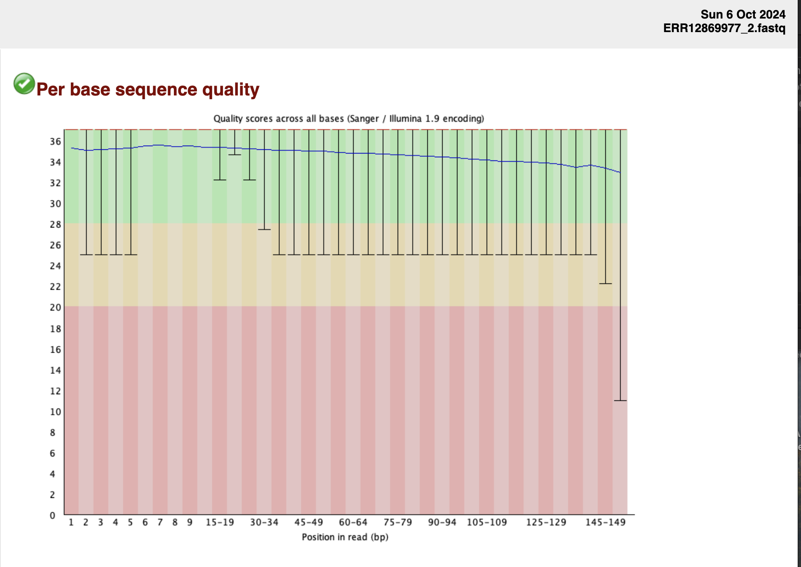
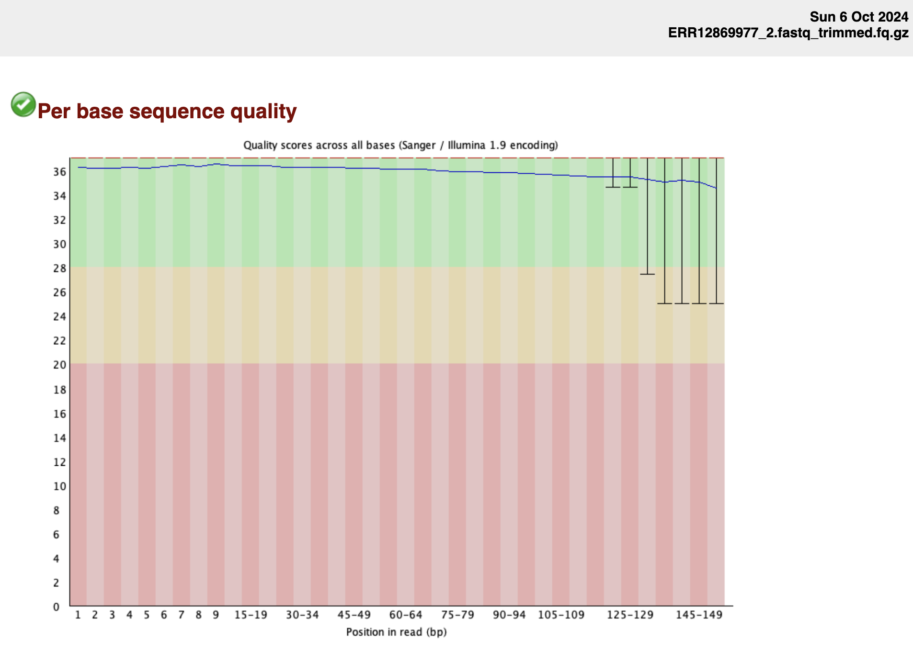

## Download FASTQ files, trim and conduct QC

The project I chose was a bumblebee diversity project, analyzing whole genome sequences across a range of habitats to find population structure. The original read quality was not too bad, but I added very strict trimming parameters. (I had a hard time finding true raw FASTQ files.)

```
# Define variables
SRA="ERR12869977"
output_dir="reads"
# Define read names
read1="${SRA}_1.fastq"
read2="${SRA}_2.fastq"
```

#### Download first 10000 reads using fastq-dump
Included the split-files option because this was PE reads.
```
echo "Downloading from ${SRA} to ${output_dir} directory"

fastq-dump -X 10000 -F --outdir reads --split-files ${SRA}
```

#### QC using fastqc 
Conducted fastq, created a specific directory for pre-trimmed fastqc files to observe.
```
echo "Running fastqc on ${output_dir}/${read1} and ${output_dir}/${read2}"
mkdir -p ${output_dir}/fastqc
fastqc ${output_dir}/${read1} ${output_dir}/${read2} -o ${output_dir}/fastqc
```
Example FASTQC pre-trimming:

Some sketchier quality scores. The adapters had already been removed before posting it to NCBI.

#### Trim adapters and low quality bases using fastp
Created specific directory for trimmed files, I used fastp as my trimming tool, with the -u option, which only allows 20% of bases in a sliding window to have a poor quality score. The -q option is the cutoff for the phred score.
```
echo "Trimming adapters and low quality bases"
mkdir -p ${output_dir}/trimmed_fastq

  fastp --thread 4 \
        --in1 "${output_dir}/${read1}" \
        --in2 "${output_dir}/${read2}" \
        --out1 "${output_dir}/trimmed_fastq/${read1}_trimmed.fq.gz" \
        --out2 "${output_dir}/trimmed_fastq/${read2}_trimmed.fq.gz" \
        -g \
       	-q 35 \
       	-u 20 
```
#### QC again
Of course, I need to check the files to make sure there was an improvement.
```
echo "Running fastqc on trimmed reads"
mkdir -p ${output_dir}/trimmed_fastq/fastqc

fastqc ${output_dir}/trimmed_fastq/${read1}_trimmed.fq.gz \
       ${output_dir}/trimmed_fastq/${read2}_trimmed.fq.gz \
       -o ${output_dir}/trimmed_fastq/fastqc
```
Final FASTQC file:

Definitley improved sequence quality overall.