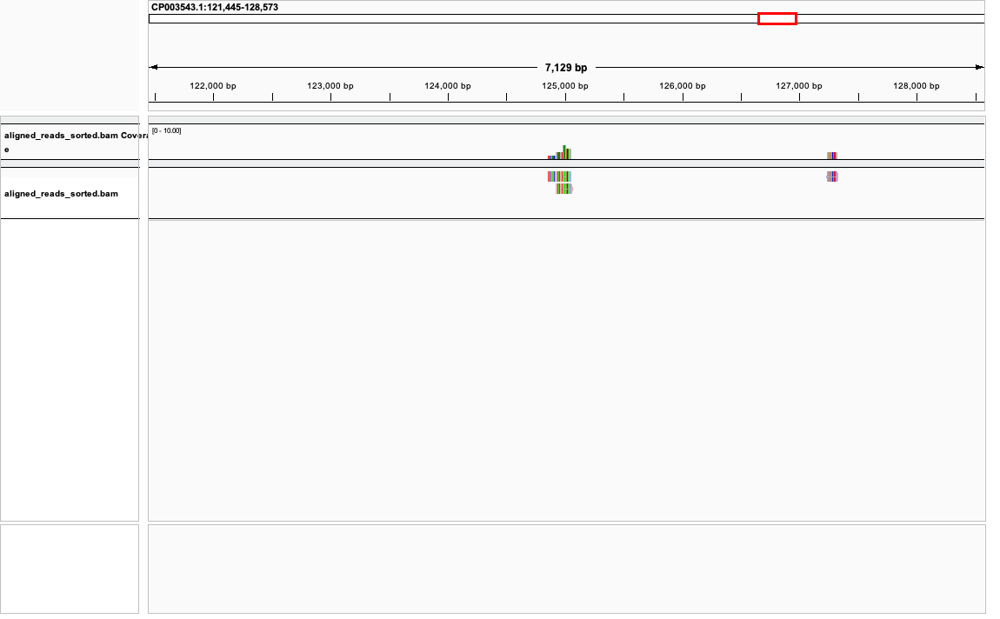

#### Short read alignment
---

Flagstats:
```
122 + 0 in total (QC-passed reads + QC-failed reads)
122 + 0 primary
0 + 0 secondary
0 + 0 supplementary
0 + 0 duplicates
0 + 0 primary duplicates
48 + 0 mapped (39.34% : N/A)
48 + 0 primary mapped (39.34% : N/A)
122 + 0 paired in sequencing
61 + 0 read1
61 + 0 read2
48 + 0 properly paired (39.34% : N/A)
48 + 0 with itself and mate mapped
0 + 0 singletons (0.00% : N/A)
0 + 0 with mate mapped to a different chr
0 + 0 with mate mapped to a different chr (mapQ>=5)
```




#### Wgsim alignment
---

Flagstats:
```
2000 + 0 in total (QC-passed reads + QC-failed reads)
2000 + 0 primary
0 + 0 secondary
0 + 0 supplementary
0 + 0 duplicates
0 + 0 primary duplicates
2000 + 0 mapped (100.00% : N/A)
2000 + 0 primary mapped (100.00% : N/A)
2000 + 0 paired in sequencing
1000 + 0 read1
1000 + 0 read2
2000 + 0 properly paired (100.00% : N/A)
2000 + 0 with itself and mate mapped
0 + 0 singletons (0.00% : N/A)
0 + 0 with mate mapped to a different chr
0 + 0 with mate mapped to a different chr (mapQ>=5)
```


---
Simulated short reads had a more coverage across the genome, and looked much more neat. They also had consistent lengths. Only 39% of the real-world reads mapped due to poor quality, but 100% of the simulated ones mapped.